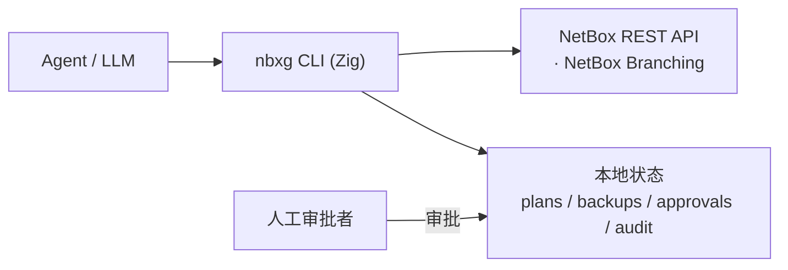

# nbx-guard

**面向 agent 的 NetBox 安全变更网关，使用 Zig 实现。**

<p align="center">
  
</p>

> 设计原则：**Agent 只提意图，CLI 决定能不能做。**
> agent 只提出变更*意图*；究竟能不能做、怎么做，由 CLI 决定。

nbx-guard 位于 LLM/agent 与 NetBox 之间。agent 永远无法直接调用 NetBox API——
它只能请求 nbx-guard 去*规划（plan）*一次变更。随后由 CLI 执行策略校验、基于风险的
审批、应用前备份、审计日志与回滚。即使 agent 声称自己拥有全部权限，审批规则也在这里
被强制执行。



## 核心保证

- **默认拒绝（default-deny）**——只有被策略明确分类的字段才可写。
- **先规划（plan first）**——没有已存储的 `plan` 就不会发生任何写入；`apply` 只接受 `plan_id`。
- **审批门禁**——高风险字段需要一份绑定到该 plan 的 `plan_hash` 的审批。
- **漂移与完整性检查**——apply 前重算 `plan_hash`、校验审批绑定，并比对资源基线值；
  发现外部改动或篡改即以 `conflict` 拒绝（写入任何备份/变更之前）。
- **可驳回（reject）**——不想执行的 plan 可显式驳回，之后 `apply` 会被拒绝。
- **应用前备份**——每次 apply 都会对资源及其原字段值做快照。
- **全程审计**——只追加（append-only）的 JSONL 轨迹，每条事件都关联 `plan_id` / `approval_id` / `backup_id` / `request_id`。
- **可回滚**——任何已应用的变更都能从其备份恢复。
- **读取最小化（read minimization）**——读取也分级：`get`/`inspect` 默认 `--fields basic`，
  把读敏感字段（如 `phone`/`email`/`comments`/`custom_fields`/`tenant`）**脱敏**；要整对象读取
  （`--fields all`）须走 `--plan-read → approve-read` 审批路径，整个披露过程进审计。
- **受治理的创建**——`create` 默认拒绝；仅对算子在 `creatable_resources`（`*`=任意类型）开启的类型放行，且**每次创建都需审批**，可经 `restore` 删除回滚。
- **无原始访问 / 无删除动作**——不暴露面向 agent 的 `delete` / `bulk_delete` / 原始 API；`DELETE` 仅供 `restore` 回滚一次创建时内部使用。
- **对 agent 友好的 JSON**——每条命令都打印一个信封，含 `ok`、`data`，以及携带 `kind`、`risk_level`、`next_action` 的 `error`。
- **自描述（self-describe）**——`describe` 让 agent 在动手前了解每个类型能改什么、输入输出 schema，并把字段元数据实时对齐真实 NetBox（`OPTIONS` 或官方 `OpenAPI` 描述文件）。

## 构建与测试

需要 **Zig 0.16.0**。

```sh
zig build           # 产出 ./zig-out/bin/nbxg
zig build test      # 运行单元测试
zig build run -- version
```

## 作为 Agent 技能安装

把 `nbxg` 及其技能说明安装给你的 Agent，使其能驱动受控的 NetBox 变更流程：

```sh
bash scripts/installer.sh
```

安装脚本会：

1. **自动判断系统类型**（linux / macos / windows，x86_64 / aarch64）。
2. **询问安装目录**，默认 `~/.agents/skills`（可用环境变量 `NBXG_INSTALL_DIR` 覆盖）；
   实际安装到 `<目录>/nbx-guard/`。
3. **若已存在则询问是否移除重装**（非交互场景设 `NBXG_ASSUME_YES=1` 自动重装）。
4. 安装 `nbxg` 二进制与 [`skills/nbx-guard/SKILL.md`](skills/nbx-guard/SKILL.md)，
   尽力把 `nbxg` 链接进 `~/.local/bin`，最后执行 **`nbxg --help`** 验证。

二进制获取顺序：发行包内同目录的 `nbxg` → 仓库 `zig-out/bin/nbxg` → 本地 `zig build`
→ 通过 `gh` 从 GitHub Release 下载（私有仓库需已登录 `gh`，可用 `NBXG_VERSION=vX.Y.Z` 指定版本）。

安装完成后，Agent 应阅读 `SKILL.md` 了解命令、字段策略、JSON 信封与 `plan→approve→apply→restore`
工作流。该文档就是给 Agent 的操作手册。

## 配置

两种等价来源：**环境变量**（见 `.env.example`），或一个 **JSON 配置文件
`~/.nbx-guard/config.json`**（安装器已自动生成）。两者可混用，**环境变量始终优先**；
唯一不能进文件的是明文 token。下表为环境变量名，括注其 config.json 键：

| 变量（config.json 键） | 默认值 | 用途 |
| --- | --- | --- |
| `NETBOX_URL`（`netbox_url`） | `http://localhost:8000` | NetBox 基础 URL |
| `NETBOX_TOKEN`（_禁止入文件_） | _（未设置）_ | API token；`get`/`inspect`/`plan`/`apply`/`restore` 必需 |
| `NETBOX_TOKEN_FILE`（`token_file`） | _（未设置）_ | 从文件读取 token（Docker/K8s secret、systemd credentials、Vault agent 文件）。 |
| `NETBOX_TOKEN_CMD`（`token_cmd`） | _（未设置）_ | 执行命令取 token（对接系统钥匙链，如 macOS `security`、Linux `secret-tool`/`pass`）。 |
| `NBX_GUARD_STATE_DIR`（`state_dir`） | `.nbx-guard` | 本地状态目录 |
| `NBX_GUARD_HTTP_TIMEOUT_MS`（`http_timeout_ms`） | `15000` | NetBox 请求连接超时（毫秒）；`0` 关闭 |
| `NBX_GUARD_BRANCHING`（`branching`） | `0` | 将读写路由进某个 NetBox Branching 分支 |
| `NBX_GUARD_BRANCH`（`branch`） | _（未设置）_ | 生效分支的 schema id（作为 `X-NetBox-Branch` 发送） |
| `NBX_GUARD_AUTO_APPROVE`（`auto_approve`） | `0` | **算子**自动审批开关：高风险 update / create 在 plan 时自动审批，仍写完整审计与备份（见下） |
| `NBX_GUARD_EXTRA_RESOURCES`（`extra_resources`） | _（未设置）_ | **算子**扩展受治理类型（`类型=端点` 列表，如 `site=dcim/sites`） |
| `NBX_GUARD_ALLOWED_FIELDS`（`allowed_fields`） | _（未设置）_ | **算子**追加的低风险字段（逗号/空格分隔） |
| `NBX_GUARD_HIGH_RISK_FIELDS`（`high_risk_fields`） | _（未设置）_ | **算子**追加的高风险字段（需审批） |
| `NBX_GUARD_READ_SENSITIVE_FIELDS`（`read_sensitive_fields`） | _（未设置）_ | **算子**追加的读敏感字段（整对象读取需 `approve-read`） |
| `NBX_GUARD_CREATABLE_RESOURCES`（`creatable_resources`） | _（未设置）_ | **算子**开启 `create` 的类型（`*`=任意类型；创建仍逐次审批） |
| `NBX_GUARD_CONFIG`（_即本文件路径_） | _（未设置）_ | **算子**配置文件路径覆盖；默认 `~/.nbx-guard/config.json` |

> **一个文件搞定（推荐）**：嫌环境变量多，就把上表的设置写进 `~/.nbx-guard/config.json`
> ——安装器已为你生成，改两行即可。明文 token **绝不入文件**（出现 `netbox_token` 键会被
> 拒绝）：用 `token_cmd`（钥匙链）或 `token_file`（文件）这两个指针，或保留 `NETBOX_TOKEN`
> 环境变量。
>
> ```json
> {
>   "netbox_url": "https://netbox.example.com",
>   "token_cmd":  "security find-generic-password -s netbox -w",
>   "auto_approve": false,
>   "allowed_fields": ["serial"], "high_risk_fields": ["tenant"]
> }
> ```

`NETBOX_TOKEN` 同时支持 NetBox v1 与 v2 token：以 `nbt_` 开头的 v2 token（NetBox 4.5+
默认）自动以 `Bearer` 方案鉴权，其余按 v1 `Token` 方案发送——把 NetBox 给你的 token
原样填入即可。已在 **NetBox Community 4.5.1（netbox-docker 3.4.2）** 上端到端验收。

### token 的安全来源（钥匙链友好）

不想把明文 token 放进环境/`.env`？除 `NETBOX_TOKEN` 外还有两种来源，**优先级
`NETBOX_TOKEN` > `NETBOX_TOKEN_CMD` > `NETBOX_TOKEN_FILE`**，读取后裁掉尾部空白：

```sh
# 1) 文件（Docker/K8s secret、systemd credentials、Vault agent 渲染文件）
export NETBOX_TOKEN_FILE=/run/secrets/netbox_token

# 2) 命令 —— 直接对接系统钥匙链
export NETBOX_TOKEN_CMD='security find-generic-password -s netbox -w'   # macOS Keychain
export NETBOX_TOKEN_CMD='secret-tool lookup service netbox'             # Linux libsecret
export NETBOX_TOKEN_CMD='pass show netbox/token'                        # pass
```

这两个指针也可写进 config.json（`token_file` / `token_cmd`）——但明文 token 本身绝不入文件。
token 绝不写入状态目录，也绝不在输出里打印；`nbxg version` 只报告
`token_configured` 与来源 `token_source`（`env` / `cmd` / `file` / `none`），便于排错。
文件读不出、命令非零退出或产出为空，都会以 `config_error`（退出码 3）明确失败。

### 自动审批（autopilot，仅算子）

默认每个高风险变更都要人工 `approve`。当你**在自己的分支/沙箱里处理数据**、只想要审计
记录而非逐条审批时，算子可开启自动审批：

```sh
export NBX_GUARD_AUTO_APPROVE=1     # 或 config.json: { "auto_approve": true }
# 强烈建议与分支搭配，让自动审批的变更落进隔离分支、再由人工 merge：
export NBX_GUARD_BRANCHING=1
export NBX_GUARD_BRANCH=<schema_id>
```

开启后，高风险 `update` 与 `create` 的 plan 在创建时即**自动生成一条 `approver: "auto"`
的审批记录**并置为 `approved`，可直接 `apply`。其余所有控制保持不变：plan_hash 完整性、
漂移检测、应用前备份、以及完整审计（事件 `auto_approved`）。这是**算子专用**开关
（与其它 `NBX_GUARD_*` 治理变量同理，agent 不应自行设置），默认关闭（fail-safe）。

当 `NBX_GUARD_BRANCHING` 启用**且** `NBX_GUARD_BRANCH` 含有某个分支的 schema id 时，
每个 NetBox 请求都会带上 `X-NetBox-Branch: <schema_id>` 头，于是受控变更落到该分支而
非 `main`。分支的创建以及之后的 `sync`/`merge`/`revert`，通过 NetBox 自身的 Branching
API 完成——这些审批者级别的生命周期操作刻意不由 agent 网关承担。

### 配置可被 Agent 提案修改（人工审批 + 审计）

一个只会拒绝的工具会把普通运维挡在门外。`nbxg` 不是放弃门禁，而是让「改门禁」本身透明且受治理：

- **`nbxg config show`**：用大白话说明当前配置允许 Agent 做什么（token 来源、受治理类型、免审批/需审批
  字段、是否自动审批），并给出「想做更多该跑哪条 `config set`」。
- **`nbxg config set <key=value> ...`**：Agent **提案**一项变更（如 `auto_approve=true`、
  `allowed_fields=serial`、`creatable_resources=site`、`extra_resources=site:dcim/sites`）。它不立即
  改动任何东西，而是生成一个 `pending_approval` 的 plan，列出改什么、从什么到什么、风险与责任。

链路与数据变更一致：`config set`（Agent 提案）→ `approve`（人类授权）→ `apply`（Agent 写入，自动备份
旧配置）→ 审计 `config_applied`。**关键安全约束**：配置变更**永不自动审批**——即使 `auto_approve` 已开启，
`config set` 仍需人工 `approve`，Agent 无法借此自我提权；明文 token 永不入文件。

## 策略（MVP）

| 分类 | 字段 | 行为 |
| --- | --- | --- |
| 允许（低风险） | `description`、`comments`、`tags`、`custom_fields`、`title`、`phone`、`email`、`link` | 直接应用 |
| 高风险 | `status`、`role`、`site`、`rack`、`prefix`、`address`、`groups` | 需要审批 |
| 其它一切 | — | **拒绝** |

支持的资源类型：`device`、`interface`、`ip-address`、`prefix`、`vlan`、`contact`。

### 读取策略（read-policy）

读取与写入分开分级。读取面默认最小化，整对象读取需审批：

| 分类 | 字段 | 行为 |
| --- | --- | --- |
| 基本（低风险读） | `id`、`name`、`display`、`status`、`serial` 等标识/非敏感字段 | `--fields basic`（默认）直接返回 |
| 读敏感 | `phone`、`email`、`comments`、`custom_fields`、`tenant` | `basic` 下脱敏；`--fields all` 整对象读取需 `approve-read` |

> 人工算子可用 `NBX_GUARD_READ_SENSITIVE_FIELDS` 追加读敏感字段（读侧对应写侧的 `*_FIELDS`）。

> **算子可扩展**：以上是内置的安全下限。人工运维方（非 agent）可用 `NBX_GUARD_EXTRA_RESOURCES`
> 增加受治理类型、用 `NBX_GUARD_ALLOWED_FIELDS` / `NBX_GUARD_HIGH_RISK_FIELDS` 增加字段
> （或等价地写进 `~/.nbx-guard/config.json`），而默认拒绝与全部工作流控制（plan/审批/备份/
> 漂移/审计/还原）保持不变，agent 自身无法扩展。详见[策略文档](docs/src/policy.md)。

## 命令

```
nbxg version                          打印版本与当前生效配置
nbxg help                             显示帮助
nbxg config show                      用大白话说明当前配置允许 Agent 做什么、以及如何放宽（无需 token）
nbxg config set <key=value> ...       提案一项治理/连接变更（人工审批 + 全程审计；绝不自动审批）
nbxg doctor [--skill <dir>]           自检：安装的二进制与 SKILL.md/源码是否一致（离线）
nbxg get <type> <id> [--fields basic|all] [--plan-read] [--plan <id>]
                                      读取资源；basic（默认）脱敏读敏感字段，all 需读审批
nbxg inspect <type> <id> [--fields basic|all]  读取资源并标注读/写字段策略
nbxg list-resources <type> [选项]     列出某类型的对象以发现 id（brief 只读）
nbxg search <type> -q <text> [选项]   按 NetBox q 模糊搜索某类型的对象
nbxg resolve <type> [--name|--slug|--address v | k=v]
                                      人类可读标识 -> 对象 id（歧义返回候选列表，绝不静默挑选）
nbxg export <type> [选项]             只读批量导出匹配资源（full 档脱敏读敏感字段）
nbxg snapshot <type> <id> [--fields basic|all] [--plan-read] [--plan <id>] [--out p]
                                      只读快照单个资源（basic 默认脱敏，all 需读审批）
nbxg describe [<type>] [--source options|openapi] [--refresh] [--offline]
                                      自描述：可写字段 / 输入输出 schema，实时对齐 NetBox
nbxg plan <type> <id> --set k=v ...   创建变更计划（做策略 + 风险校验）
nbxg create <type> --set k=v ...      创建新对象的计划（仅限算子开启的类型；始终需审批）
nbxg approve --plan <id> [--note x]   审批一个高风险 plan（绑定 plan_hash）
nbxg approve-read --plan <id> [--note x]  审批一次敏感对象的整体读取（绑定 plan_hash）
nbxg reject --plan <id> [--note x]    驳回一个 plan（之后 apply 会被拒绝）
nbxg apply --plan <id>                先备份，再应用一个已审批/低风险的 plan
nbxg restore --backup <id>            从备份快照回滚资源
nbxg audit [--plan <id>]              显示审计日志
nbxg list <plans|approvals|backups>   列出本地状态
```

`--set` 的取值在可能时按 JSON 解析（数字、布尔、数组、对象），否则当作字符串——
例如 `--set description="edge router"`、`--set tags='["core"]'`。

## 工作流

### 低风险变更

```sh
export NETBOX_URL=http://netbox.local NETBOX_TOKEN=xxxx

nbxg plan device 1 --set description="edge router"
# -> { plan_id, plan_hash, risk_level: "low", status: "planned", next_action: "apply" }

nbxg apply --plan plan_...      # 快照、PATCH、写审计 + 备份
nbxg restore --backup bkp_...   # 需要时回滚
```

### 高风险变更（需要审批）

```sh
nbxg plan device 1 --set status=active
# -> status: "pending_approval", next_action: "approve"

nbxg apply --plan plan_...      # 被拒：error.kind = "not_approved"

nbxg approve --plan plan_... --note "approved by netops"
nbxg apply --plan plan_...      # 现在被允许
```

### 敏感字段的整体读取（需要读审批）

```sh
nbxg get device 123                         # 默认 basic：读敏感字段被脱敏
nbxg get device 123 --fields all            # 含敏感字段 -> error.kind = "needs_approval"

nbxg get device 123 --fields all --plan-read
# -> 创建读 plan（rplan_...），status: "pending_approval"，并返回脱敏预览

nbxg approve-read --plan rplan_... --note "approved by netops"
nbxg get device 123 --fields all --plan rplan_...   # 现在披露整对象（进审计）
```

## 响应信封

```json
{
  "ok": false,
  "command": "apply",
  "data": null,
  "error": {
    "kind": "not_approved",
    "message": "high-risk plan requires approval before apply",
    "risk_level": "high",
    "next_action": "run `nbxg approve --plan <plan_id>` first"
  }
}
```

`error.kind` 为以下之一：`invalid_args`、`config_error`、`policy_denied`、`invalid_field`、
`needs_approval`、`not_approved`、`plan_not_found`、`approval_not_found`、`backup_not_found`、
`plan_state_error`、`netbox_error`、`conflict`、`io_error`、`not_implemented`。

退出码：`0` 成功，`2` 客户端/策略/状态错误，`3` 上游/配置/IO 错误。

## 本地状态布局

```
.nbx-guard/
├── plans/<plan_id>.json
├── approvals/<approval_id>.json
├── backups/<backup_id>.json
└── audit.jsonl
```

## 源码布局

| 文件 | 职责 |
| --- | --- |
| `src/main.zig` | 入口；构建 `Context`，分发，设置退出码 |
| `src/cli.zig` | 命令层 / 工作流编排 |
| `src/context.zig` | 共享上下文 + JSON 响应信封 + 错误模型 |
| `src/config.zig` | 由环境变量驱动的配置 |
| `src/policy.zig` | 默认拒绝的字段策略引擎 |
| `src/plan.zig` | plan 模型、changes 解析、确定性 `plan_hash` |
| `src/approval.zig` | 绑定到 `plan_hash` 的审批记录 |
| `src/backup.zig` | 应用前快照与原值捕获 |
| `src/audit.zig` | 只追加的 JSONL 审计日志 |
| `src/netbox.zig` | NetBox REST 客户端（仅 GET / PATCH） |
| `src/store.zig` | 本地 JSON/JSONL 状态存储 |
| `src/ids.zig` | id 生成与 SHA-256 哈希 |

## 技术栈

- 语言：**Zig 0.16**
- HTTP：`std.http.Client`
- JSON：`std.json`
- 状态：本地 JSON 文件 + JSONL 审计日志

## 状态

MVP。启用 NetBox Branching 后，受控变更经 `X-NetBox-Branch` 头路由进某个分支；分支
生命周期（`sync` / `merge` / `revert`）由 NetBox 自身的 Branching API 处理。未启用分支时，
默认应用方式是对 `main` 直接 PATCH。
