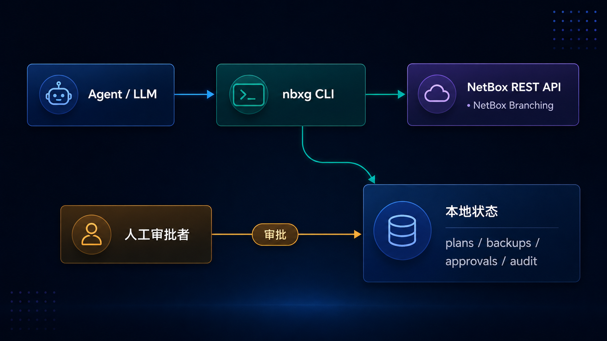

# nbx-guard

**给 AI agent 用的 NetBox 安全改配网关。**

<p align="center">
  
</p>

> 一句话：**Agent 只能提想法，能不能改、怎么改，nbxg 说了算。**

nbx-guard 夹在 AI agent 和 NetBox 中间。agent 碰不到 NetBox API，只能请 nbxg 把一次改动先「写成计划」。之后放不放行、要不要人批、改前备份、记审计、能不能回滚，全由 nbxg 把关。哪怕 agent 自称有最高权限，也绕不过这些规则。

<p align="center">
  
</p>

## 核心保证

- **默认拒绝（default-deny）**：只有被明确归类的字段才让写，其它一律挡掉。
- **先有计划才动手**：没存过 `plan` 就不会有任何写操作；`apply` 只认 `plan_id`。
- **该批的得批**：高风险字段要一份审批，且和这份 plan 的 `plan_hash` 绑死。
- **防篡改、防偏移**：apply 前重算 `plan_hash`、查审批绑定、比对线上现值；一旦发现被人动过手脚，直接按 `conflict` 拒绝——此时还没碰任何备份和数据。
- **能驳回**：不想要的 plan 可以 `reject` 掉，之后再 `apply` 它会被拦。
- **改前先备份**：每次 apply 都先给资源和原值拍一张快照。
- **全程留痕**：只增不改的 JSONL 审计流，每条都挂上 `plan_id` / `approval_id` / `backup_id` / `request_id`。
- **能回滚**：改过的东西都能照备份还原。
- **读取也克制**：`get`/`inspect` 默认 `--fields basic`，把敏感字段（`phone`/`email`/`comments`/`custom_fields`/`tenant`）打码；想看完整对象（`--fields all`）得走 `--plan-read → approve-read` 审批，整个过程进审计。
- **建对象也受管**：`create` 默认禁；只有管理员在 `creatable_resources`（`*`=不限类型）里点了名的类型才放行，而且每次都要批，建错了能用 `restore` 删掉回滚。
- **没后门、不能删**：不给 agent 开 `delete` / `bulk_delete` / 原始 API；`DELETE` 只在 `restore` 回滚一次创建时内部用一下。
- **输出对 agent 友好**：每条命令都吐一个 JSON 信封，带 `ok`、`data`，出错时还带 `kind`、`risk_level`、`next_action`。
- **会自我介绍**：`describe` 让 agent 动手前就知道每种类型能改哪些字段、输入输出长什么样，字段信息实时对齐真实 NetBox（走 `OPTIONS` 或官方 OpenAPI 描述文件）。

## 用起来什么感觉

下面这段对话，能让你大概感受到 agent 接上 nbx-guard 之后是怎么干活的——它只会「提议」，放不放行由 nbxg 把关：

> **你**：把交换机 `sw-core-01` 的描述改成「核心交换机·A 排」。
>
> **Agent**：这算低风险，我生成了计划 `plan_a1b2`（`description` → 「核心交换机·A 排」），已经应用好了 ✅。改之前自动备份了原值，审计也记上了。
>
> **你**：再把它的角色从「接入」换成「核心」。
>
> **Agent**：这个字段是高风险，按规矩**得你点头**才行。计划摆这儿：`role: 接入 → 核心`（`plan_c3d4`）。批不批？
>
> **你**：批。
>
> **Agent**：好。审批和这份计划绑死了，应用前我又重算了一遍哈希、跟线上现值核对没问题，已改 ✅。要是不对，一句话我就照备份回滚。
>
> **你**：那台下线的旧设备 `sw-old-09` 顺手删了吧。
>
> **Agent**：删不了——nbxg 压根没给我开 `delete` 权限。我顶多帮你提个「状态改成 decommissioning」的计划交给你批；真要物理删除，得你自己去 NetBox 操作。
>
> **你**：行，那就改状态。
>
> **Agent**：计划 `plan_e5f6` 生成好了（`status: active → decommissioning`，高风险，等你审批）。

一来一回里：低风险的直接过、高风险的必须人批、危险操作（删除）根本没开口子，而且每一步都留了计划、备份和审计——这就是 nbx-guard 想给你的那份「放心」。

## 作为 Agent 技能安装

一句话：把 `nbxg`（二进制）和它的技能说明（`SKILL.md`）装到位，你的 agent 就能用它安全地改 NetBox。下面几种方式从最省事到最适合开发者，挑一种就行。

### 一行远程安装（最省事，推荐运维）

不用克隆仓库，一条命令把**预编译二进制 + 技能目录 + 默认配置**全装好：

```sh
curl -fsSL https://raw.githubusercontent.com/terateams/nbx-guard/main/scripts/install.sh | bash
```

它会自动认系统、从 GitHub Release 下对应的 `nbxg`、校验 SHA256、装技能到 `~/.agents/skills/nbx-guard/`、软链 `nbxg` 到 `~/.local/bin`，并在 `~/.nbx-guard/config.json` 放一份默认配置（**已存在绝不覆盖**）。想锁版本加 `NBXG_VERSION=vX.Y.Z`，想换目录用 `NBXG_INSTALL_DIR` / `NBXG_BINDIR`。

### 用 npx skills 装（跨 agent 技能生态）

如果你用 [`npx skills`](https://github.com/vercel-labs/skills) 管理 agent 技能，直接拉本仓库的技能说明：

```sh
npx skills add terateams/nbx-guard
```

> ⚠️ 这只装**技能文档**（让各家 agent 认识 nbx-guard），不含 `nbxg` 二进制。还得用上面的 curl 一行（或下面任一方式）把二进制装上，命令才能真正跑起来。

### 从源码一键安装（开发者友好）

有 Zig 0.16.0 的话，在仓库里一条命令搞定**编译 → 软链到 PATH → 装好技能目录**：

```sh
make install     # 编译 → 软链 ~/.local/bin/nbxg → 装技能到 ~/.agents/skills/nbx-guard/
make uninstall   # 移除二进制与技能目录（保留 ~/.nbx-guard 用户数据）
make             # 查看全部目标（build / test / fmt / clean ...）
```

想换位置就传变量，例如 `make install PREFIX=/usr/local SKILLS_DIR=~/skills`。

装完后让 agent 读一遍 [`SKILL.md`](skills/nbx-guard/SKILL.md)——命令、字段策略、JSON 信封、`plan→approve→apply→restore` 流程都在里面，这就是给 agent 的操作手册。

## 配置

两种方式，效果一样：写**环境变量**（见 `.env.example`），或写一个 **JSON 文件 `~/.nbx-guard/config.json`**（安装时已自动生成）。可以混着用，**环境变量优先**；唯一不能进文件的是明文 token。下表是环境变量名，括号里是它在 config.json 里对应的键：

| 变量（config.json 键） | 默认值 | 用途 |
| --- | --- | --- |
| `NETBOX_URL`（`netbox_url`） | `http://localhost:8000` | NetBox 基础 URL |
| `NETBOX_TOKEN`（_禁止入文件_） | _（未设置）_ | API token；`get`/`inspect`/`plan`/`apply`/`restore` 必需 |
| `NETBOX_TOKEN_FILE`（`token_file`） | _（未设置）_ | 从文件读取 token（Docker/K8s secret、systemd credentials、Vault agent 文件）。 |
| `NETBOX_TOKEN_CMD`（`token_cmd`） | _（未设置）_ | 执行命令取 token（对接系统钥匙链，如 macOS `security`、Linux `secret-tool`/`pass`）。 |
| `NBX_GUARD_STATE_DIR`（`state_dir`） | `.nbx-guard` | 本地状态目录 |
| `NBX_GUARD_HTTP_TIMEOUT_MS`（`http_timeout_ms`） | `15000` | NetBox 请求连接超时（毫秒）；`0` 关闭 |
| `NBX_GUARD_BRANCHING`（`branching`） | `0` | 把读写都走某个 NetBox Branching 分支 |
| `NBX_GUARD_BRANCH`（`branch`） | _（未设置）_ | 生效分支的 schema id（作为 `X-NetBox-Branch` 发送） |
| `NBX_GUARD_AUTO_APPROVE`（`auto_approve`） | `0` | **管理员**开关：开了之后高风险 update/create 在 plan 时自动批，审计和备份照写（见下） |
| `NBX_GUARD_EXTRA_RESOURCES`（`extra_resources`） | _（未设置）_ | **管理员**加受管类型（`类型=端点`，如 `site=dcim/sites`） |
| `NBX_GUARD_ALLOWED_FIELDS`（`allowed_fields`） | _（未设置）_ | **管理员**加的免审批字段（逗号/空格分隔） |
| `NBX_GUARD_HIGH_RISK_FIELDS`（`high_risk_fields`） | _（未设置）_ | **管理员**加的高风险字段（要审批） |
| `NBX_GUARD_READ_SENSITIVE_FIELDS`（`read_sensitive_fields`） | _（未设置）_ | **管理员**加的读敏感字段（整对象读取要 `approve-read`） |
| `NBX_GUARD_CREATABLE_RESOURCES`（`creatable_resources`） | _（未设置）_ | **管理员**允许 `create` 的类型（`*`=不限；每次创建仍要审批） |
| `NBX_GUARD_CONFIG`（_即本文件路径_） | _（未设置）_ | 改配置文件路径；默认 `~/.nbx-guard/config.json` |

> **嫌变量多？一个文件就够（推荐）**：把上表的设置写进 `~/.nbx-guard/config.json`（安装时已生成，改两行就行）。明文 token **绝不入文件**（写了 `netbox_token` 键会被拒）：要么用 `token_cmd`（接钥匙链）或 `token_file`（指向文件）这两个指针，要么留着 `NETBOX_TOKEN` 环境变量。
>
> ```json
> {
>   "netbox_url": "https://netbox.example.com",
>   "token_cmd":  "security find-generic-password -s netbox -w",
>   "auto_approve": false,
>   "allowed_fields": ["serial"], "high_risk_fields": ["tenant"]
> }
> ```

`NETBOX_TOKEN` 对 v1、v2 token 都认：`nbt_` 开头的 v2 token（NetBox 4.5+ 默认）自动用 `Bearer`，其余用 v1 的 `Token`——把 NetBox 给你的 token 原样粘进来就行。已在 **NetBox Community 4.5.1（netbox-docker 3.4.2）** 上跑通端到端验收。

### token 的安全来源（钥匙链友好）

不想把明文 token 写进环境变量或 `.env`？除了 `NETBOX_TOKEN`，还有两种来源，**优先级 `NETBOX_TOKEN` > `NETBOX_TOKEN_CMD` > `NETBOX_TOKEN_FILE`**，读进来后会自动去掉末尾空白：

```sh
# 1) 文件（Docker/K8s secret、systemd credentials、Vault agent 渲染文件）
export NETBOX_TOKEN_FILE=/run/secrets/netbox_token

# 2) 命令 —— 直接对接系统钥匙链
export NETBOX_TOKEN_CMD='security find-generic-password -s netbox -w'   # macOS Keychain
export NETBOX_TOKEN_CMD='secret-tool lookup service netbox'             # Linux libsecret
export NETBOX_TOKEN_CMD='pass show netbox/token'                        # pass
```

这两个指针也能写进 config.json（`token_file` / `token_cmd`），但明文 token 本身绝不入文件。token 不会写进状态目录，也不会打印到输出；`nbxg version` 只告诉你 `token_configured`（配没配）和来源 `token_source`（`env` / `cmd` / `file` / `none`），方便排错。文件读不到、命令非零退出或输出为空，都会以 `config_error`（退出码 3）直接报错。

### 自动审批（autopilot，仅管理员可开）

默认每个高风险变更都要人工 `approve`。如果你是**在自己的分支或沙箱里改数据**，只想留个审计记录、不想一条条点批准，管理员可以开自动审批：

```sh
export NBX_GUARD_AUTO_APPROVE=1     # 或 config.json: { "auto_approve": true }
# 强烈建议配合分支用：让自动批的变更落到隔离分支，再由人工 merge：
export NBX_GUARD_BRANCHING=1
export NBX_GUARD_BRANCH=<schema_id>
```

开了之后，高风险 `update` 和 `create` 的 plan 一创建就**自动带一条 `approver: "auto"` 的审批**、直接是 `approved`，可以马上 `apply`。其它把关一个不少：plan_hash 校验、漂移检测、改前备份、完整审计（事件 `auto_approved`）。这是**管理员专用**开关（和其它 `NBX_GUARD_*` 治理变量一样，agent 不该自己设），默认关着，图个安全。

当 `NBX_GUARD_BRANCHING` 打开**且** `NBX_GUARD_BRANCH` 填了某个分支的 schema id 时，每个 NetBox 请求都会带上 `X-NetBox-Branch: <schema_id>`，受控变更就落到那个分支、而不是 `main`。建分支以及之后的 `sync`/`merge`/`revert` 走 NetBox 自己的 Branching API——这些审批者级别的操作故意不交给 agent 网关。

### 配置可被 Agent 提案修改（人工审批 + 审计）

一个只会拒绝的工具，等于把普通运维挡在门外。`nbxg` 不是不要门禁，而是让「改门禁」这件事本身也透明、可审计：

- **`nbxg config show`**：用大白话说清当前配置允许 agent 做什么（token 来源、受管类型、免审批/需审批字段、有没有开自动审批），还告诉你「想多干点该敲哪条 `config set`」。
- **`nbxg config set <key=value> ...`**：agent **提个变更**（比如 `auto_approve=true`、`allowed_fields=serial`、`creatable_resources=site`、`extra_resources=site:dcim/sites`）。它不会立刻改任何东西，而是生成一个 `pending_approval` 的 plan，写清改哪项、从什么变成什么、有什么风险和责任。

流程和改数据一样：`config set`（agent 提案）→ `approve`（人来授权）→ `apply`（agent 写入，旧配置自动备份）→ 审计 `config_applied`。**最关键的一条**：改配置**永远不会自动审批**——哪怕 `auto_approve` 开着，`config set` 也得人工 `approve`，agent 没法借它给自己提权；明文 token 也永远进不了文件。

## 策略（MVP）

| 分类 | 字段 | 行为 |
| --- | --- | --- |
| 允许（低风险） | `description`、`comments`、`tags`、`custom_fields`、`title`、`phone`、`email`、`link` | 直接应用 |
| 高风险 | `status`、`role`、`site`、`rack`、`prefix`、`address`、`groups` | 需要审批 |
| 其它一切 | — | **拒绝** |

支持的资源类型：`device`、`interface`、`ip-address`、`prefix`、`vlan`、`contact`。

### 读取策略（read-policy）

读和写分开管。读取默认只给最少信息，要看整对象得先审批：

| 分类 | 字段 | 行为 |
| --- | --- | --- |
| 基本（低风险读） | `id`、`name`、`display`、`status`、`serial` 等标识/非敏感字段 | `--fields basic`（默认）直接返回 |
| 读敏感 | `phone`、`email`、`comments`、`custom_fields`、`tenant` | `basic` 下脱敏；`--fields all` 整对象读取需 `approve-read` |

> 管理员可以用 `NBX_GUARD_READ_SENSITIVE_FIELDS` 再加读敏感字段（读这边对应写那边的 `*_FIELDS`）。

> **管理员能扩**：上面是内置的安全下限。运维方（不是 agent）可以用 `NBX_GUARD_EXTRA_RESOURCES`
> 加受管类型、用 `NBX_GUARD_ALLOWED_FIELDS` / `NBX_GUARD_HIGH_RISK_FIELDS` 加字段（或写进
> `~/.nbx-guard/config.json`）；默认拒绝和全套流程控制（plan/审批/备份/漂移/审计/还原）一律不变，
> agent 自己扩不了。详见[策略文档](docs/src/policy.md)。

## 命令

```
nbxg version                          打印版本与当前生效配置
nbxg help                             显示帮助
nbxg config show                      用大白话说明当前配置允许 Agent 做什么、以及如何放宽（无需 token）
nbxg config set <key=value> ...       提案一项治理/连接变更（人工审批 + 全程审计；绝不自动审批）
nbxg doctor [--skill <dir>]           自检：安装的二进制与 SKILL.md/源码是否一致（离线）
nbxg get <type> <id> [--fields basic|all] [--plan-read] [--plan <id>]
                                      读取资源；basic（默认）脱敏读敏感字段，all 需读审批
nbxg inspect <type> <id> [--fields basic|all]  读取资源并标注读/写字段策略
nbxg list-resources <type> [选项]     列出某类型的对象以发现 id（brief 只读）
nbxg search <type> -q <text> [选项]   按 NetBox q 模糊搜索某类型的对象
nbxg resolve <type> [--name|--slug|--address v | k=v]
                                      人类可读标识 -> 对象 id（歧义返回候选列表，绝不静默挑选）
nbxg export <type> [选项]             只读批量导出匹配资源（full 档脱敏读敏感字段）
nbxg snapshot <type> <id> [--fields basic|all] [--plan-read] [--plan <id>] [--out p]
                                      只读快照单个资源（basic 默认脱敏，all 需读审批）
nbxg describe [<type>] [--source options|openapi] [--refresh] [--offline]
                                      自描述：可写字段 / 输入输出 schema，实时对齐 NetBox
nbxg plan <type> <id> --set k=v ... | --data '{...}'   创建变更计划（做策略 + 风险校验）
nbxg create <type> --set k=v ... | --data '{...}'      创建新对象的计划（仅限管理员开启的类型；每次都要审批）
nbxg approve --plan <id> [--note x]   审批一个高风险 plan（绑定 plan_hash）
nbxg approve-read --plan <id> [--note x]  审批一次敏感对象的整体读取（绑定 plan_hash）
nbxg reject --plan <id> [--note x]    驳回一个 plan（之后 apply 会被拒绝）
nbxg apply --plan <id>                先备份，再应用一个已审批/低风险的 plan
nbxg restore --backup <id>            从备份快照回滚资源
nbxg audit [--plan <id>]              显示审计日志
nbxg list <plans|approvals|backups>   列出本地状态
```

`--set` 的值能当 JSON 就当 JSON 解析（数字、布尔、数组、对象），不行就按字符串——
例如 `--set description="edge router"`、`--set tags='["core"]'`。

### 字段也能用一整段 JSON 传

`plan` 和 `create` 的字段，除了一个个 `--set`，也能用一整段 JSON 对象传进去——
内联字符串、文件、或从 stdin 管道都行。字段多、或本来就拿着一份 JSON 时更省事：

```sh
# 内联 JSON 字符串
nbxg create site --data '{"name":"POP3","slug":"pop3"}'

# 从文件读（@ 前缀，或用 --data-file）
nbxg create site --data @site.json
nbxg create site --data-file site.json

# 从 stdin 管道读（@-）
echo '{"description":"edge router"}' | nbxg plan device 1 --data @-

# --data 打底，再用 --set 覆盖个别字段（从左到右，后者覆盖前者）
nbxg create site --data @site.json --set status=active
```

`--data` 顶层必须是一个 JSON 对象（`{字段: 值}`）；它和 `--set` 走的是同一条管道，
策略、风险、`plan_hash`、漂移、备份、审计的行为完全一致，只是字段的写法不同。

## 工作流

### 低风险变更

```sh
export NETBOX_URL=http://netbox.local NETBOX_TOKEN=xxxx

nbxg plan device 1 --set description="edge router"
# -> { plan_id, plan_hash, risk_level: "low", status: "planned", next_action: "apply" }

nbxg apply --plan plan_...      # 快照、PATCH、写审计 + 备份
nbxg restore --backup bkp_...   # 需要时回滚
```

### 高风险变更（需要审批）

```sh
nbxg plan device 1 --set status=active
# -> status: "pending_approval", next_action: "approve"

nbxg apply --plan plan_...      # 被拒：error.kind = "not_approved"

nbxg approve --plan plan_... --note "approved by netops"
nbxg apply --plan plan_...      # 现在被允许
```

### 敏感字段的整体读取（需要读审批）

```sh
nbxg get device 123                         # 默认 basic：读敏感字段被脱敏
nbxg get device 123 --fields all            # 含敏感字段 -> error.kind = "needs_approval"

nbxg get device 123 --fields all --plan-read
# -> 创建读 plan（rplan_...），status: "pending_approval"，并返回脱敏预览

nbxg approve-read --plan rplan_... --note "approved by netops"
nbxg get device 123 --fields all --plan rplan_...   # 现在披露整对象（进审计）
```

## 响应信封

```json
{
  "ok": false,
  "command": "apply",
  "data": null,
  "error": {
    "kind": "not_approved",
    "message": "high-risk plan requires approval before apply",
    "risk_level": "high",
    "next_action": "run `nbxg approve --plan <plan_id>` first"
  }
}
```

`error.kind` 为以下之一：`invalid_args`、`config_error`、`policy_denied`、`invalid_field`、
`needs_approval`、`not_approved`、`plan_not_found`、`approval_not_found`、`backup_not_found`、
`plan_state_error`、`netbox_error`、`conflict`、`io_error`、`not_implemented`。

退出码：`0` 成功，`2` 客户端/策略/状态错误，`3` 上游/配置/IO 错误。

## 本地状态布局

```
.nbx-guard/
├── plans/<plan_id>.json
├── approvals/<approval_id>.json
├── backups/<backup_id>.json
└── audit.jsonl
```

## 构建与测试

只有要改源码才需要，普通使用者跳过即可。需要 Zig 0.16.0：

```sh
zig build           # 产出 ./zig-out/bin/nbxg
zig build test      # 运行单元测试
zig build run -- version
```

## 源码布局

| 文件 | 职责 |
| --- | --- |
| `src/main.zig` | 入口；构建 `Context`，分发，设置退出码 |
| `src/cli.zig` | 命令层 / 工作流编排 |
| `src/context.zig` | 共享上下文 + JSON 响应信封 + 错误模型 |
| `src/config.zig` | 由环境变量驱动的配置 |
| `src/policy.zig` | 默认拒绝的字段策略引擎 |
| `src/plan.zig` | plan 模型、changes 解析、确定性 `plan_hash` |
| `src/approval.zig` | 绑定到 `plan_hash` 的审批记录 |
| `src/backup.zig` | 应用前快照与原值捕获 |
| `src/audit.zig` | 只追加的 JSONL 审计日志 |
| `src/netbox.zig` | NetBox REST 客户端（仅 GET / PATCH） |
| `src/store.zig` | 本地 JSON/JSONL 状态存储 |
| `src/ids.zig` | id 生成与 SHA-256 哈希 |

## 技术栈

- 语言：Zig 0.16
- HTTP：`std.http.Client`
- JSON：`std.json`
- 状态：本地 JSON 文件 + JSONL 审计日志

## 状态

还是 MVP 阶段。开了 NetBox Branching，受控变更就经 `X-NetBox-Branch` 走某个分支；分支的
`sync` / `merge` / `revert` 由 NetBox 自己的 Branching API 管。没开分支时，默认就是对 `main`
直接 PATCH。

## 许可证

[MIT](./LICENSE) © terateams
