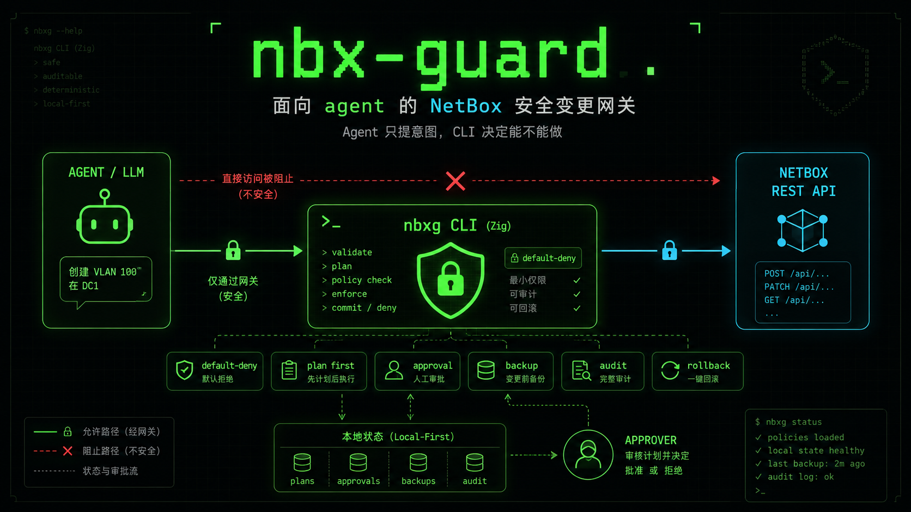
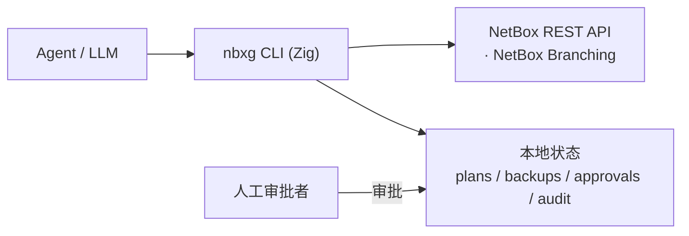

# nbx-guard

**面向 agent 的 NetBox 安全变更网关，使用 Zig 实现。**

<p align="center">
  
</p>

> 设计原则：**Agent 只提意图，CLI 决定能不能做。**
> agent 只提出变更*意图*；究竟能不能做、怎么做，由 CLI 决定。

nbx-guard 位于 LLM/agent 与 NetBox 之间。agent 永远无法直接调用 NetBox API——
它只能请求 nbx-guard 去*规划（plan）*一次变更。随后由 CLI 执行策略校验、基于风险的
审批、应用前备份、审计日志与回滚。即使 agent 声称自己拥有全部权限，审批规则也在这里
被强制执行。



## 核心保证

- **默认拒绝（default-deny）**——只有被策略明确分类的字段才可写。
- **先规划（plan first）**——没有已存储的 `plan` 就不会发生任何写入；`apply` 只接受 `plan_id`。
- **审批门禁**——高风险字段需要一份绑定到该 plan 的 `plan_hash` 的审批。
- **漂移与完整性检查**——apply 前重算 `plan_hash`、校验审批绑定，并比对资源基线值；
  发现外部改动或篡改即以 `conflict` 拒绝（写入任何备份/变更之前）。
- **可驳回（reject）**——不想执行的 plan 可显式驳回，之后 `apply` 会被拒绝。
- **应用前备份**——每次 apply 都会对资源及其原字段值做快照。
- **全程审计**——只追加（append-only）的 JSONL 轨迹，每条事件都关联 `plan_id` / `approval_id` / `backup_id` / `request_id`。
- **可回滚**——任何已应用的变更都能从其备份恢复。
- **无原始访问 / 无删除**——只允许 `update`；`delete` / `bulk_delete` / 原始 API 访问都不暴露。
- **对 agent 友好的 JSON**——每条命令都打印一个信封，含 `ok`、`data`，以及携带 `kind`、`risk_level`、`next_action` 的 `error`。
- **自描述（self-describe）**——`describe` 让 agent 在动手前了解每个类型能改什么、输入输出 schema，并把字段元数据实时对齐真实 NetBox（`OPTIONS` 或官方 `OpenAPI` 描述文件）。

## 构建与测试

需要 **Zig 0.16.0**。

```sh
zig build           # 产出 ./zig-out/bin/nbxg
zig build test      # 运行单元测试
zig build run -- version
```

## 作为 Agent 技能安装

把 `nbxg` 及其技能说明安装给你的 Agent，使其能驱动受控的 NetBox 变更流程：

```sh
bash scripts/installer.sh
```

安装脚本会：

1. **自动判断系统类型**（linux / macos / windows，x86_64 / aarch64）。
2. **询问安装目录**，默认 `~/.agents/skills`（可用环境变量 `NBXG_INSTALL_DIR` 覆盖）；
   实际安装到 `<目录>/nbx-guard/`。
3. **若已存在则询问是否移除重装**（非交互场景设 `NBXG_ASSUME_YES=1` 自动重装）。
4. 安装 `nbxg` 二进制与 [`skills/nbx-guard/SKILL.md`](skills/nbx-guard/SKILL.md)，
   尽力把 `nbxg` 链接进 `~/.local/bin`，最后执行 **`nbxg --help`** 验证。

二进制获取顺序：发行包内同目录的 `nbxg` → 仓库 `zig-out/bin/nbxg` → 本地 `zig build`
→ 通过 `gh` 从 GitHub Release 下载（私有仓库需已登录 `gh`，可用 `NBXG_VERSION=vX.Y.Z` 指定版本）。

安装完成后，Agent 应阅读 `SKILL.md` 了解命令、字段策略、JSON 信封与 `plan→approve→apply→restore`
工作流。该文档就是给 Agent 的操作手册。

## 配置

通过环境变量设置（见 `.env.example`）：

| 变量 | 默认值 | 用途 |
| --- | --- | --- |
| `NETBOX_URL` | `http://localhost:8000` | NetBox 基础 URL |
| `NETBOX_TOKEN` | _（未设置）_ | API token；`get`/`inspect`/`plan`/`apply`/`restore` 必需 |
| `NBX_GUARD_STATE_DIR` | `.nbx-guard` | 本地状态目录 |
| `NBX_GUARD_HTTP_TIMEOUT_MS` | `15000` | NetBox 请求连接超时（毫秒）；`0` 关闭 |
| `NBX_GUARD_BRANCHING` | `0` | 将读写路由进某个 NetBox Branching 分支 |
| `NBX_GUARD_BRANCH` | _（未设置）_ | 生效分支的 schema id（作为 `X-NetBox-Branch` 发送） |
| `NBX_GUARD_EXTRA_RESOURCES` | _（未设置）_ | **算子**扩展受治理类型（`类型=端点` 列表，如 `site=dcim/sites`） |
| `NBX_GUARD_ALLOWED_FIELDS` | _（未设置）_ | **算子**追加的低风险字段（逗号/空格分隔） |
| `NBX_GUARD_HIGH_RISK_FIELDS` | _（未设置）_ | **算子**追加的高风险字段（需审批） |

`NETBOX_TOKEN` 同时支持 NetBox v1 与 v2 token：以 `nbt_` 开头的 v2 token（NetBox 4.5+
默认）自动以 `Bearer` 方案鉴权，其余按 v1 `Token` 方案发送——把 NetBox 给你的 token
原样填入即可。已在 **NetBox Community 4.5.1（netbox-docker 3.4.2）** 上端到端验收。

当 `NBX_GUARD_BRANCHING` 启用**且** `NBX_GUARD_BRANCH` 含有某个分支的 schema id 时，
每个 NetBox 请求都会带上 `X-NetBox-Branch: <schema_id>` 头，于是受控变更落到该分支而
非 `main`。分支的创建以及之后的 `sync`/`merge`/`revert`，通过 NetBox 自身的 Branching
API 完成——这些审批者级别的生命周期操作刻意不由 agent 网关承担。

## 策略（MVP）

| 分类 | 字段 | 行为 |
| --- | --- | --- |
| 允许（低风险） | `description`、`comments`、`tags`、`custom_fields`、`title`、`phone`、`email`、`link` | 直接应用 |
| 高风险 | `status`、`role`、`site`、`rack`、`prefix`、`address`、`groups` | 需要审批 |
| 其它一切 | — | **拒绝** |

支持的资源类型：`device`、`interface`、`ip-address`、`prefix`、`vlan`、`contact`。

> **算子可扩展**：以上是内置的安全下限。人工运维方（非 agent）可用 `NBX_GUARD_EXTRA_RESOURCES`
> 增加受治理类型、用 `NBX_GUARD_ALLOWED_FIELDS` / `NBX_GUARD_HIGH_RISK_FIELDS` 增加字段，
> 而默认拒绝与全部工作流控制（plan/审批/备份/漂移/审计/还原）保持不变，agent 自身无法扩展。
> 详见[策略文档](docs/src/policy.md)。

## 命令

```
nbxg version                          打印版本与当前生效配置
nbxg help                             显示帮助
nbxg get <type> <id>                  读取资源（只读）
nbxg inspect <type> <id>              读取资源并标注字段策略
nbxg list-resources <type> [选项]     列出某类型的对象以发现 id（brief 只读）
nbxg search <type> -q <text> [选项]   按 NetBox q 模糊搜索某类型的对象
nbxg export <type> [选项]             只读导出/快照匹配资源（含来源元数据）
nbxg snapshot <type> <id> [--out p]   只读快照单个资源（含来源元数据）
nbxg describe [<type>] [--source options|openapi] [--refresh] [--offline]
                                      自描述：可写字段 / 输入输出 schema，实时对齐 NetBox
nbxg plan <type> <id> --set k=v ...   创建变更计划（做策略 + 风险校验）
nbxg approve --plan <id> [--note x]   审批一个高风险 plan（绑定 plan_hash）
nbxg reject --plan <id> [--note x]    驳回一个 plan（之后 apply 会被拒绝）
nbxg apply --plan <id>                先备份，再应用一个已审批/低风险的 plan
nbxg restore --backup <id>            从备份快照回滚资源
nbxg audit [--plan <id>]              显示审计日志
nbxg list <plans|approvals|backups>   列出本地状态
```

`--set` 的取值在可能时按 JSON 解析（数字、布尔、数组、对象），否则当作字符串——
例如 `--set description="edge router"`、`--set tags='["core"]'`。

## 工作流

### 低风险变更

```sh
export NETBOX_URL=http://netbox.local NETBOX_TOKEN=xxxx

nbxg plan device 1 --set description="edge router"
# -> { plan_id, plan_hash, risk_level: "low", status: "planned", next_action: "apply" }

nbxg apply --plan plan_...      # 快照、PATCH、写审计 + 备份
nbxg restore --backup bkp_...   # 需要时回滚
```

### 高风险变更（需要审批）

```sh
nbxg plan device 1 --set status=active
# -> status: "pending_approval", next_action: "approve"

nbxg apply --plan plan_...      # 被拒：error.kind = "not_approved"

nbxg approve --plan plan_... --note "approved by netops"
nbxg apply --plan plan_...      # 现在被允许
```

## 响应信封

```json
{
  "ok": false,
  "command": "apply",
  "data": null,
  "error": {
    "kind": "not_approved",
    "message": "high-risk plan requires approval before apply",
    "risk_level": "high",
    "next_action": "run `nbxg approve --plan <plan_id>` first"
  }
}
```

`error.kind` 为以下之一：`invalid_args`、`config_error`、`policy_denied`、`invalid_field`、
`needs_approval`、`not_approved`、`plan_not_found`、`approval_not_found`、`backup_not_found`、
`plan_state_error`、`netbox_error`、`conflict`、`io_error`、`not_implemented`。

退出码：`0` 成功，`2` 客户端/策略/状态错误，`3` 上游/配置/IO 错误。

## 本地状态布局

```
.nbx-guard/
├── plans/<plan_id>.json
├── approvals/<approval_id>.json
├── backups/<backup_id>.json
└── audit.jsonl
```

## 源码布局

| 文件 | 职责 |
| --- | --- |
| `src/main.zig` | 入口；构建 `Context`，分发，设置退出码 |
| `src/cli.zig` | 命令层 / 工作流编排 |
| `src/context.zig` | 共享上下文 + JSON 响应信封 + 错误模型 |
| `src/config.zig` | 由环境变量驱动的配置 |
| `src/policy.zig` | 默认拒绝的字段策略引擎 |
| `src/plan.zig` | plan 模型、changes 解析、确定性 `plan_hash` |
| `src/approval.zig` | 绑定到 `plan_hash` 的审批记录 |
| `src/backup.zig` | 应用前快照与原值捕获 |
| `src/audit.zig` | 只追加的 JSONL 审计日志 |
| `src/netbox.zig` | NetBox REST 客户端（仅 GET / PATCH） |
| `src/store.zig` | 本地 JSON/JSONL 状态存储 |
| `src/ids.zig` | id 生成与 SHA-256 哈希 |

## 技术栈

- 语言：**Zig 0.16**
- HTTP：`std.http.Client`
- JSON：`std.json`
- 状态：本地 JSON 文件 + JSONL 审计日志

## 状态

MVP。启用 NetBox Branching 后，受控变更经 `X-NetBox-Branch` 头路由进某个分支；分支
生命周期（`sync` / `merge` / `revert`）由 NetBox 自身的 Branching API 处理。未启用分支时，
默认应用方式是对 `main` 直接 PATCH。
